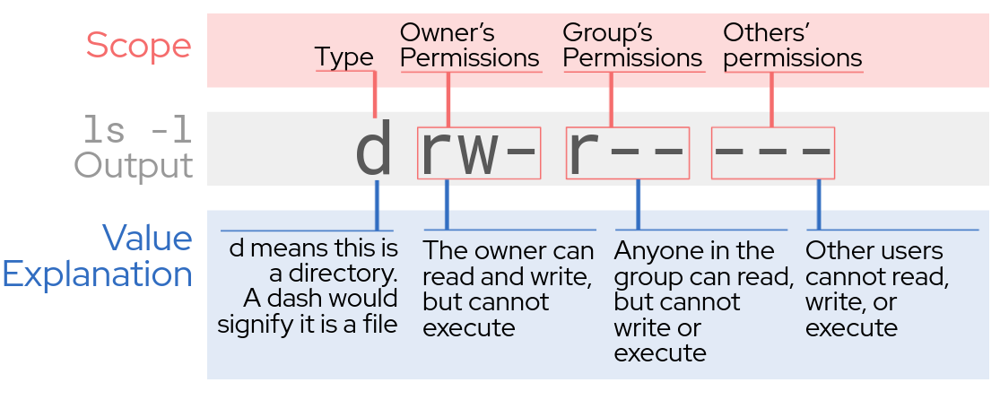

# What are file permissions?

File permissions determine which users can operate on files on a system.
These operations are broken down into three categories:
* Read: Viewing the contents of a file
* Write: Changing the contents of a file
* Execute: Running contents of a file as code

It is important to properly assign permissions to files and directories
created on a shared system so that files are not accidentally (or maliciously)
tampered with, destroyed, or executed. The next section shows you how to
view the permissions of files in an example directory.

# Displaying Files and Their Permissions

For this lab, you will be working in the `srv` directory. Change to it using the
`cd` (change directory) command:

`cd /srv/`{{execute T1}}

The command `ls -l` can be used to look at the permissions associated with each
file in the directory. The output for this can be cryptic at first, so here is
a breakdown of what each character in the permissions string means.
The access mode __-rwxr-x---__ conveys the following information:

Take a look at the contents of the current directory.
Using the `-l` flag displays information about permissions for each item.

`ls -l`{{execute T1}}

The first column of this output is the permissions string explained above.
The middle columns give information about the owner of the files, their size,
the time last modified, and finally the file/directory name itself.

<pre class=file>
drw-r-----. 2 root root  94 Jun  2 21:08 proprietary
-rwxr-x---. 1 root root  66 Jun  2 21:08 status.sh
-rwxr-x---. 1 root root 117 Jun  2 21:08 tasks.txt
</pre>

>_NOTE:_ Line 2 of this output is the same permission string as the example given above

In this lab you will walk through some examples of what each of these mean in practice.
