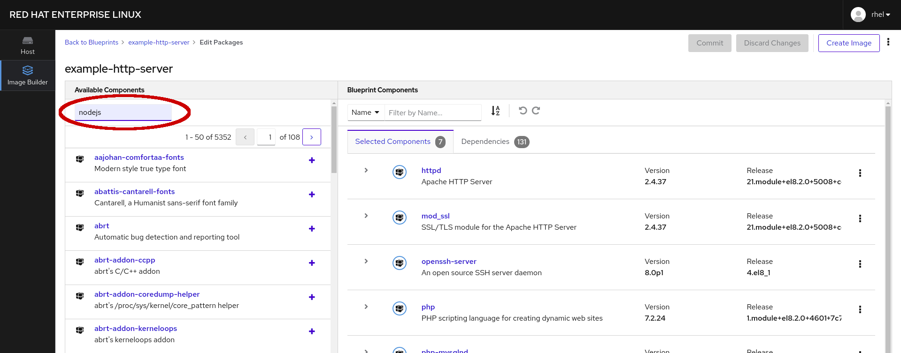
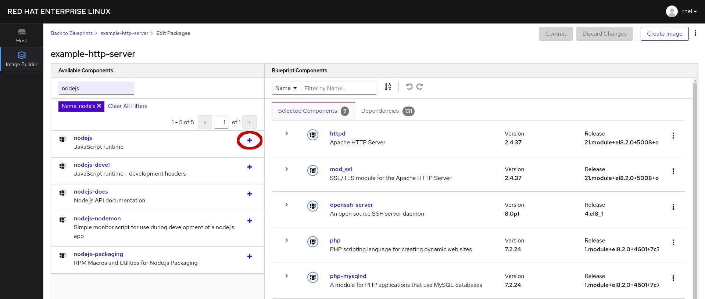

# ブループリントのパッケージを編集する

*イメージビルダー* アプリケーションでは、いくつかのブループリントが用意されています。準備ができたら、 *example-http-server* ブループリントの編集ページを表示するには、 *パッケージの編集* ボタンを押します。

ブループリントのパッケージページの右側には、httpd, mod_ssl, openssh-serverなど、このブループリントから構築されたシステムに含まれるパッケージが表示されています。

このページの左側には利用可能なパッケージのリストがあります。このブループリントに __nodejs__ を足しましょう。100ページ以上にわたる、5000以上の利用可能なパッケージがありますが、 *名前での絞り込み…*  に入力すると素早く __nodejs__ パッケージを発見できます。

フィルタが適用されると、名前に __nodejs__ が含まれるパッケージが表示されます。ブループリントに追加するには**nodejs** の隣にある "+" 記号をクリックします。

このパッケージの別のバージョンに興味がある場合や、このパッケージに対する依存関係を満たすためにブループリントに追加されるパッケージを見たい場合は、 *+* ではなくパッケージ名をクリックしてください。
