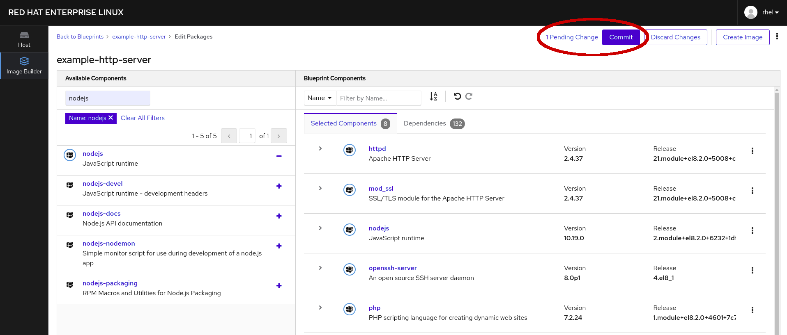

# ブループリントに変更をコミットする

このブループリントに対応するパッケージが更新されたので、変更を *コミット* するオプションと、保留中の変更を確認するリンク *1 Pending Change*、ブループリントに加えられた変更を破棄するオプション *変更の破棄* が表示されます。

*コミット* を選んで変更します。

ブループリントに変更をコミットすることを確認するダイアログウィンドウが表示されます。 変更を*コミット*します。

ページ丈夫の右側に、ブループリントへの変更が完了したことを確認するメッセージが表示されます。

最後に、次のステップへの準備として、 *example-http-server* ブループリントのページへ移動します。

