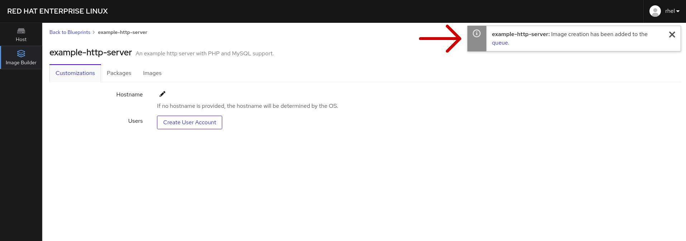

# 仮想マシンイメージの作成

前のステップのあと、 *example-http-server* のブループリントのホームページが表示されるはずです。このページでは、ブループリントをカスタマイズ(ユーザアカウントやホスト名の編集など)したり、ブループリントに含まれているパッケージを見たり、ブループリントで作成したイメージを見たり、ブループリントに含まれているパッケージを編集することができます。

しかし、ブループリントのパッケージにnodejsを追加したところなので、次に仮想マシンを作成しましょう。このプロセスを開始するには *イメージの作成* ボタンを使用します。

ダイアログが表示され、イメージの出力フォーマットを選択できます。ローカル仮想化デプロイメント、パブリック、またはプライベートクラウドプロバイダー用にオプションがあります。 この演習では、*QEMU QCOW2 Image (.qcow2)* を選択します。これは、ネイティブの Red Hat Enterprise Linux の仮想化技術である KVM で使用されるフォーマットです。

フォーマットを決定したら、*作成* ボタンをクリックしてマシンのビルドを開始します。

Image Builderのビルドキューにそのイメージが追加されたという通知が表示されます。

