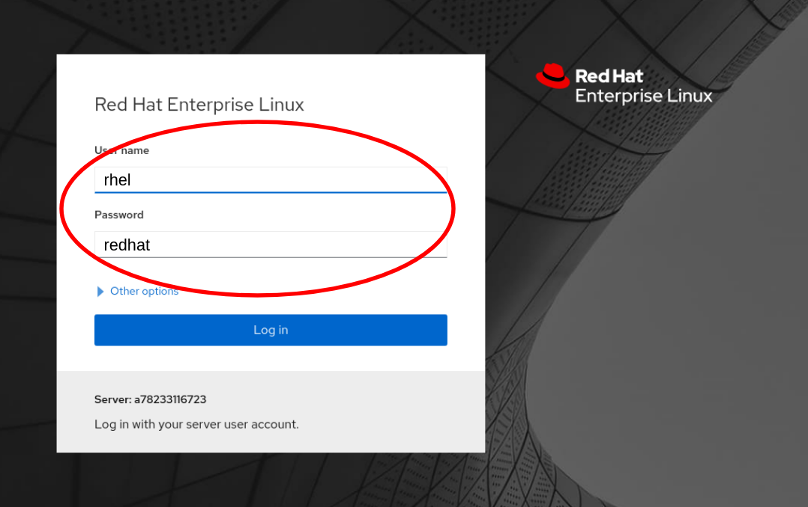

# Log in to the Web Console

Click on the tab titled *Web Console* at the top of  your lab system interface.
Selecting this tab will pop out the lab system's web console.

Once the login page is presented, use the following credentials to log into the web console:

Username: __rhel__   
Password: __redhat__

