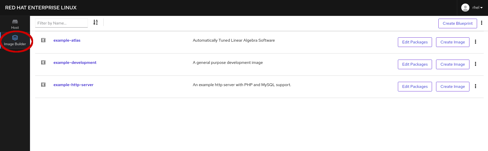

# Navigate to Image Builder application
After logging into the Web Console, you are probably already looking at the 
Image Builder tab.  If, instead, you are looking at the **Host** tab, navigate 
to the Image Builder tab, as shown below:

On the Image Builder tab, you can see that you can:
* Create Blueprint
* Access one of the three example blueprints, by clicking on the name
* Edit Packages included in images generated by a blueprint
* Create Image to make a new virtual machine image from a blueprint
* Export or Delete a blueprint (in the extended options)

