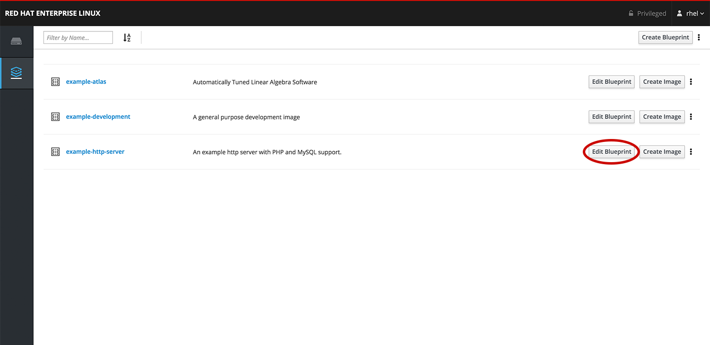
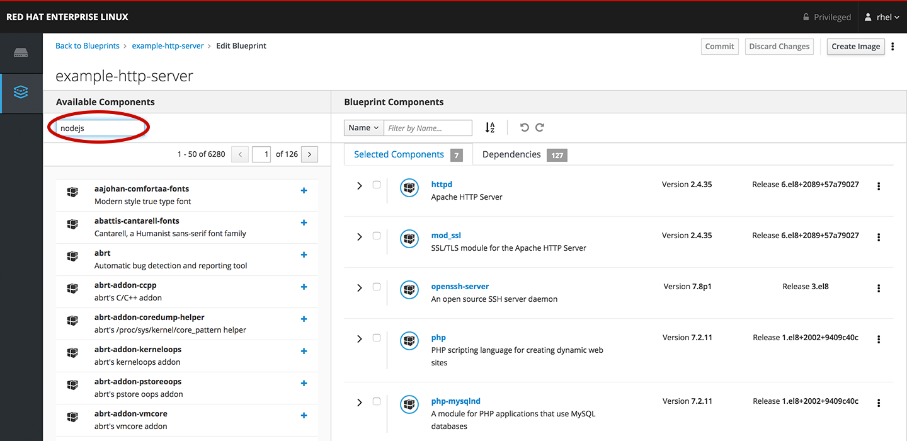
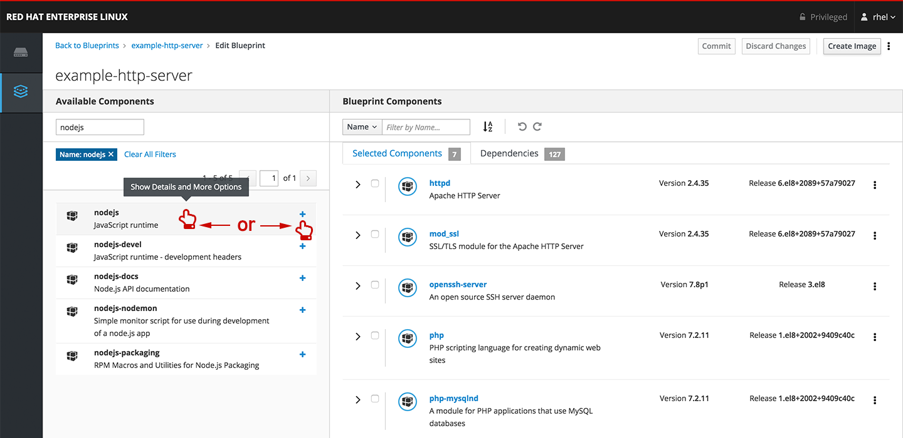

# Edit packages in a blueprint

You can see in the *Image Builder* application that there are several 
blueprints available. When you are ready, go to the edit page for the 
*example-http-server* blueprint by clicking the *Edit Packages* 
button.

On the right-side of the blueprint packages page, you can see packages already
included in systems built from this blueprint, like httpd, mod_ssl, 
openssh-server, and others.

On the left-side of the page is a list of available packages.  You want to
add __nodejs__ to the blueprint.  You could search across the over 5000
available packages through the over 100 pages, however it would be faster to
use the *Filter By Name...* field to locate the __nodejs__ package.

Once the filter has been applied, you should now see packages with __nodejs__
included in their name.  Click the *+* sign next to **nodejs** to add it to
the blueprint.

If you were interested in other versions of this package or wanted to view the
additional packages brought into the blueprint as dependencies for this package,
you could click on the package name instead of *+*.
