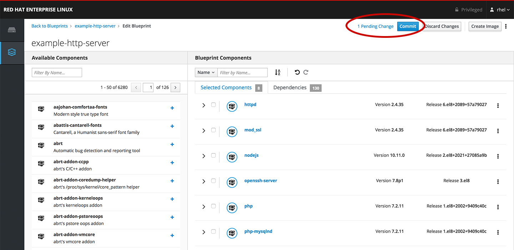
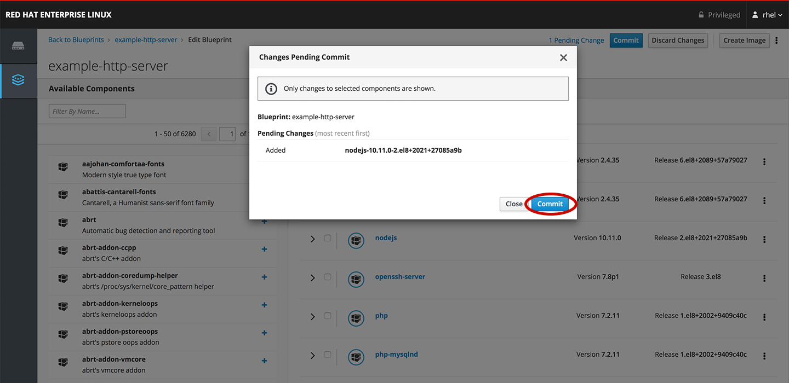
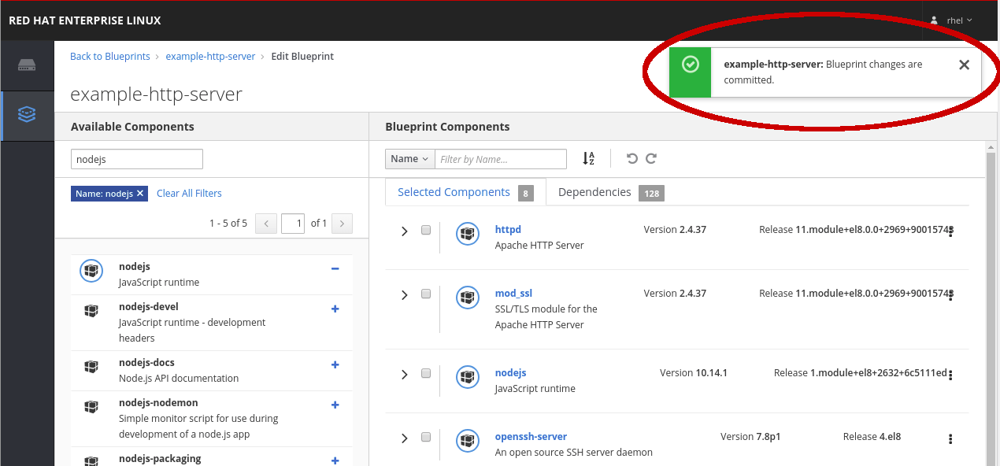
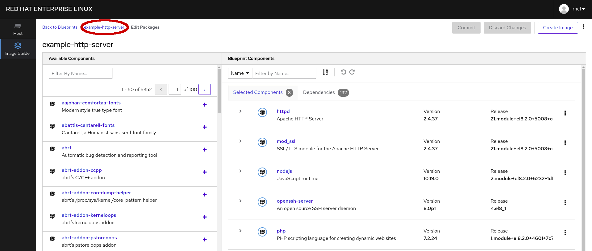

# Commit changes to the blueprint

Now that the packages associated with this blueprint have been updated, you
should now see an option to *Commit* the change as well as a link to review
the pending changes *1 Pending Change* and an option to discard changes
made to to the blueprint, *Discard Changes*.

Select to *Commit* the change.

A dialog window will appear to confirm that you want to commit the change to
the blueprint.  *Commit* the change.

You should see a message displayed in the top, right-hand side of the page that
confirms the change to the blueprint has been completed.

Lastly, to prepare for the next step, navigate to the *example-http-server*
blueprint page.

