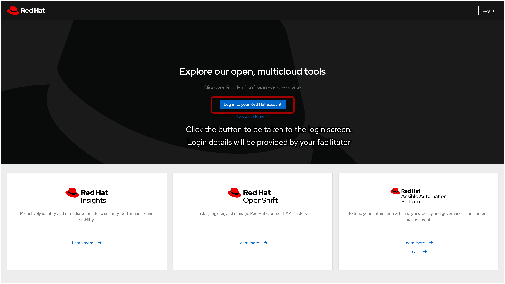
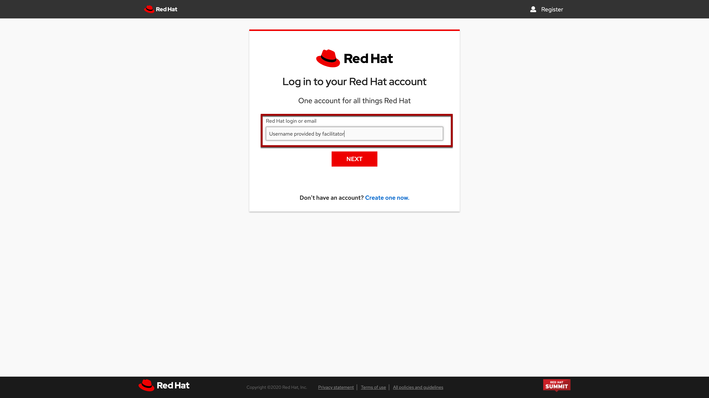
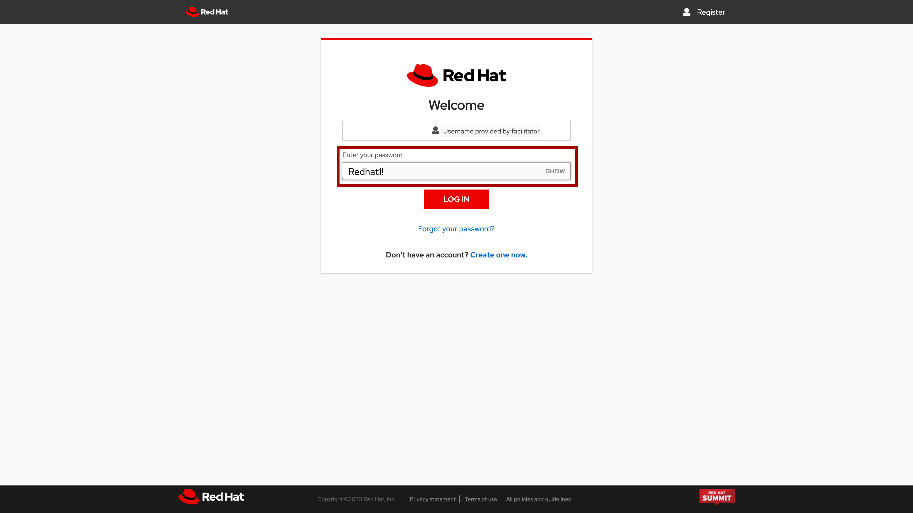
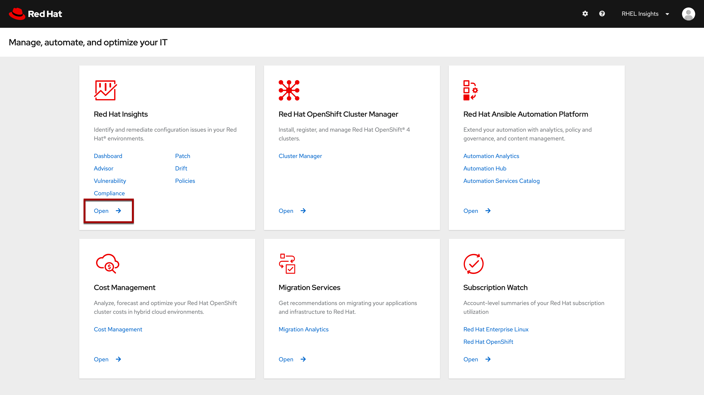

# Logging into Red Hat Insights service   

Click the hyperlink or browse to <a href="https://cloud.redhat.com" target="_blank">cloud.redhat.com</a>
to access Red Hat's software as a service web portal.

>_NOTE:_ This will open an additional browser window or tab.

Click the _Log in to your Red Hat account_ button.

Login using the username provided by your workshop facilitator.

Enter the password provided by your workshop facilitator (commonly this is __Redhat1!__).

Once you are logged in, using the credentials provided by your workshop
facilitator, navigate to the _Red Hat Insights_ tile and click Open.

