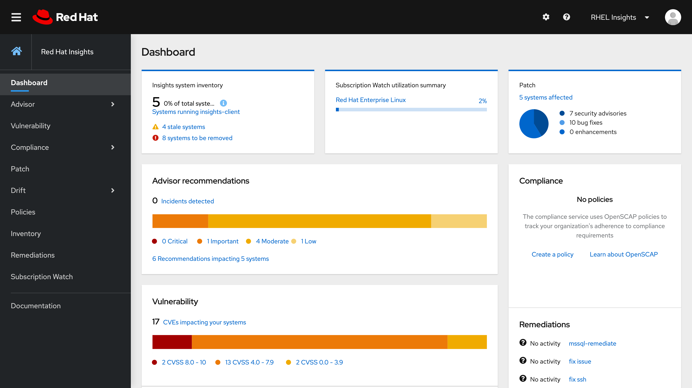
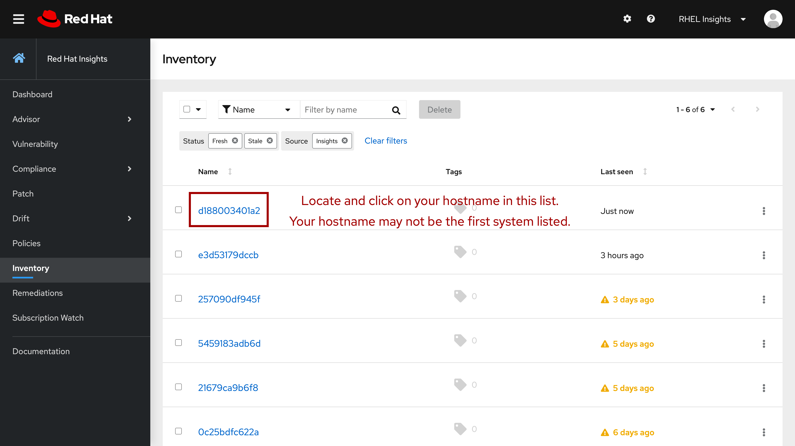

# Navigating the Insights service

Now that you have opened Red Hat Insights for Red Hat Enterprise Linux, you 
will see a summary dashboard of all systems registered to your organization.

For the purposes of this exercise, you are working with a single machine
registered to Insights and we will focus on the Advisor recommendations 
available for that host.  Click on the _Inventory_ link on the left 
navigation bar.

Once you are on the Inventory page, find and click your hostname to pull up
information for your individual machine.  Recall in a previous step you
found your machine hostname with the `hostname` command.

>_NOTE:_ Your host may not be the first one listed, as depicted in the graphic above.  You may find it necessary to use the _Find system by name_ search function at the top of the list of hosts to more quickly find your system.

