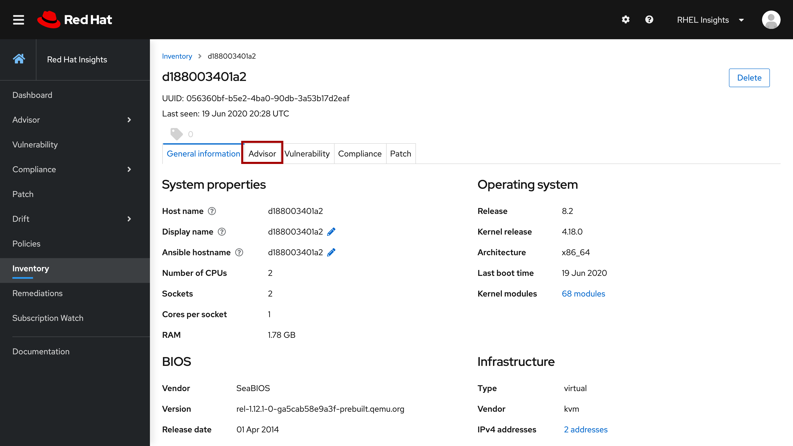

# Reviewing system Insights

After selecting your system from the Inventory page and reviewing some
overall data about it, click on the _Advisor_ tab to view the Red Hat
Insights data that applies to this host.

There may be several recommendations listed for this system.  Scroll down through the
list until you reach the one entitled _Decreased security: OpenSSH ClientAlive settings_

From the _Detected issues_ section of the recommendation, you can see that this recommendation
is being triggered by the machine running OpenSSH and using some default
configuration settings.  

In the _Steps to resolve_ section of the recommendation, additional details, 
including your daemon settings as well as the suggested settings and an 
explaination of why this may cause an issue are described.

The _Steps to resolve_ section continues with a description of how you
may want to configure the OpenSSH service as well as what would need to
be done after the service configuration is complete in order to resolve
the detected issue with the machine.

