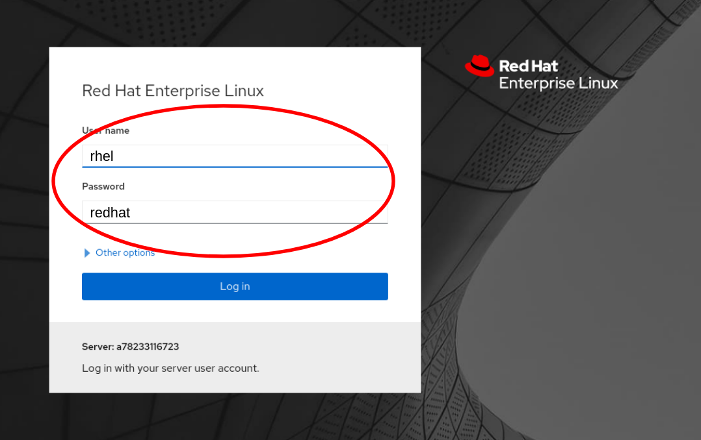
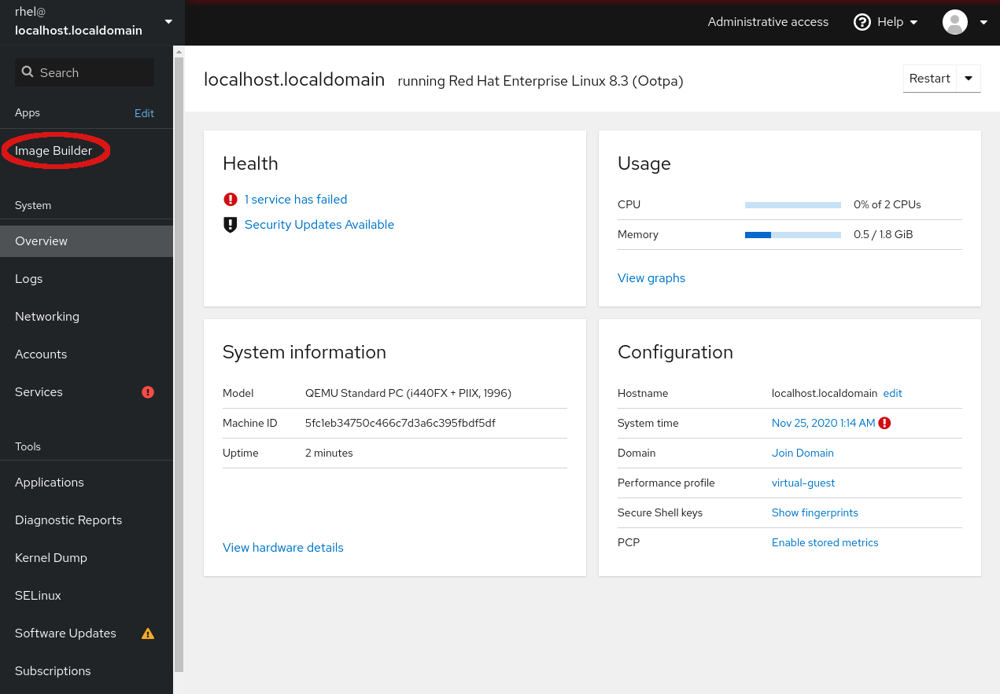
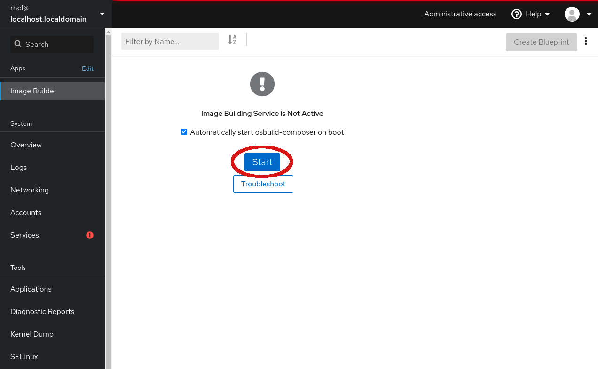

# Log in to the Web Console

Click on the tab titled *Web Console* at the top of your lab system interface.
Selecting this tab will pop out the lab system's web console.

Once the login page is presented, use the following credentials to log into the web console:

Username: __rhel__
Password: __redhat__

# Navigate to Image Builder application

After logging into the Web Console, you'll be looking at the Overview tab. Navigate to the Image Builder tab, as shown below:

Because you have not used Image Builder before, you will need to start the back-end service by clicking the *Start* button. Notice that the *Automatically start osbuild-composer on boot* is selected, which means the service will automatically start after this whenever the system is booted.

Now that the back-end service has been started, you will notice that the application screen updates and you can now *Create Blueprint*, which is what you will do on the next step.