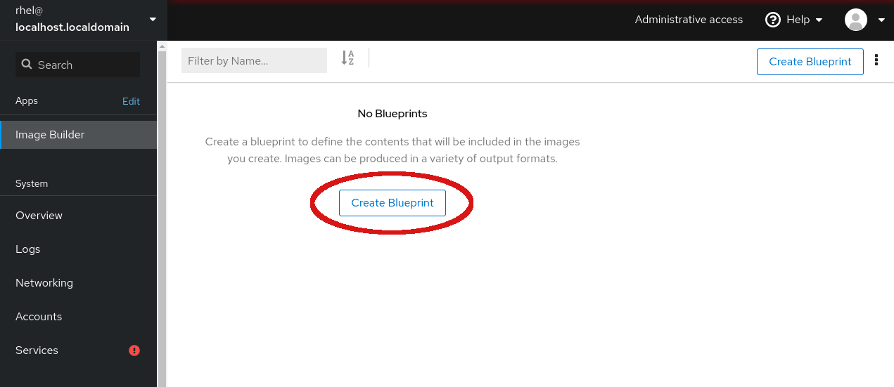
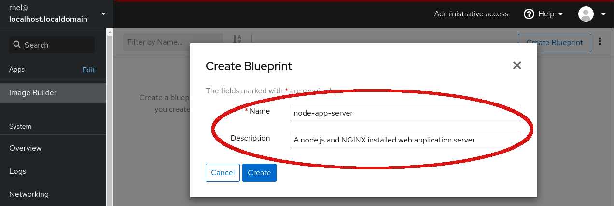
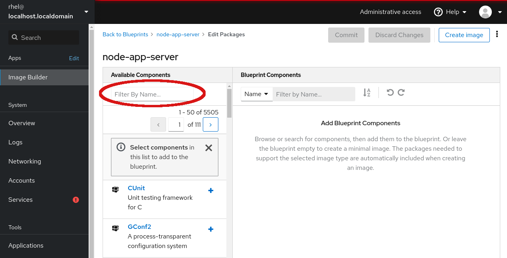
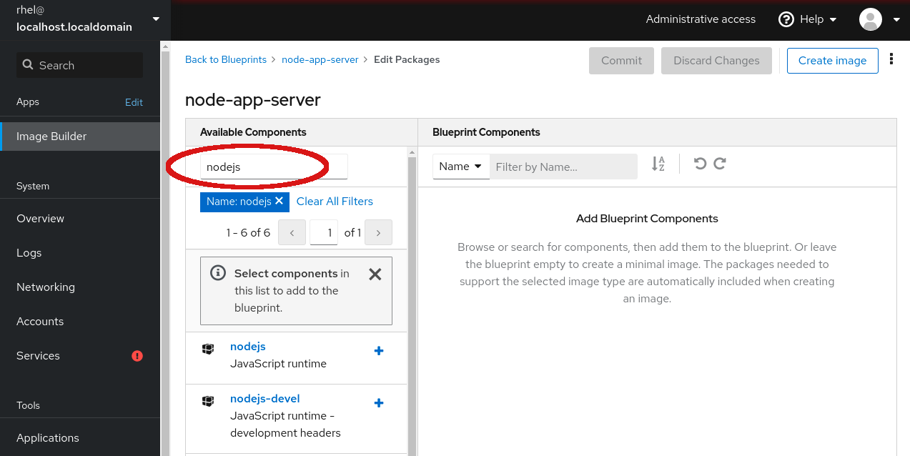
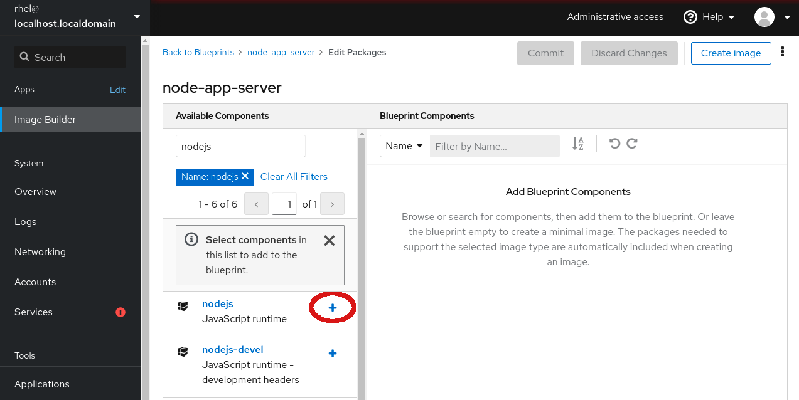
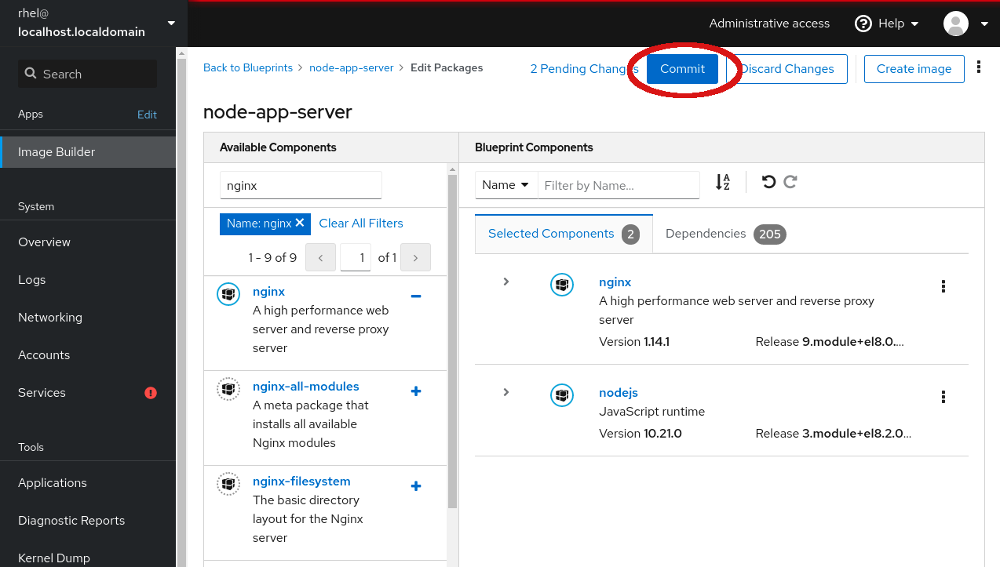
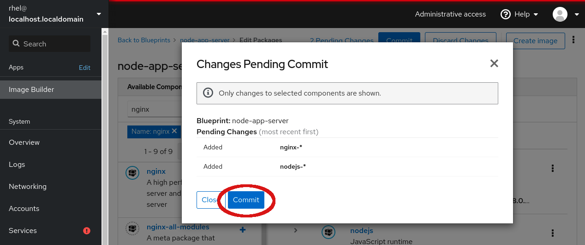

# Creating a blueprint

Image Builder uses blueprints to create system images, however, none exist
on this system  yet.

Select the *Create Blueprint* button to start building your first blueprint.

The first step to creating a new blueprint is naming it.  It is recommended
that you also include a description so that others using this blueprint know
what system image they are building.  For this lab, use __node-app-server__
as the *Name* and __A node.js and NGINX installed web application server__ as
the *Description*.

On the right-side of the blueprint packages page, you can see packages already
included in systems built from this blueprint, however, because your blueprint
is new, this area suggests you *Add Blueprint Components*.

On the left-side of the page is a list of available packages.  You want to
add __nodejs__ and __nginx__ to the blueprint.  You could search across the
over 5000 available packages through the over 100 pages, however it would be
faster to use the *Filter By Name...* field to locate the packages.

Add in the first package, __nodejs__, into the *Filter By Name*. Once the
filter has been applied, you should now see packages with __nodejs__
included in their name.

Click the *+* sign next to __nodejs__ to add it to the blueprint.

If you were interested in other versions of this package or wanted to view the
additional packages brought into the blueprint as dependencies for this package,
you could click on the package name instead of *+*.

You will notice that now __nodejs__ is listed on the right-side of the
application under *Selected Components* and that 164 additional packages
have been brought in as dependencies to support the selection of __nodejs__.

Follow the same procedure of filtering for __nginx__ and add NGINX to the
blueprint as well.

Now that the desired packages have been added to the blueprint, it is time
to commit the changes.  Select the *Commit* button at the top of the interface
to apply these updates to the blueprint.

You will be asked to confirm these changes prior to the blueprint being updated.Select *Commit* on the dialog to confirm and complete creating your first
Image Builder blueprint!

