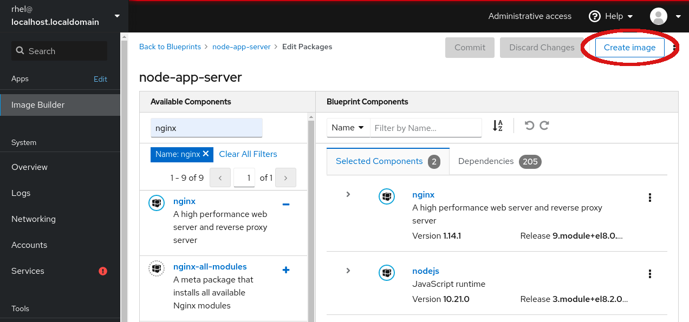
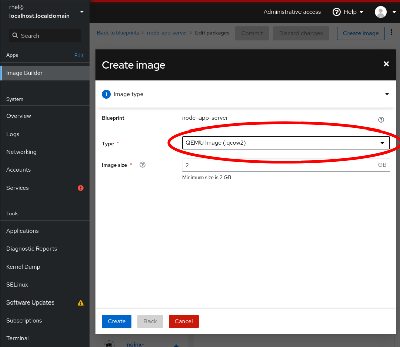
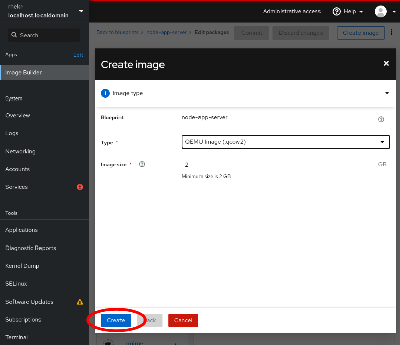

# Building an Image

You are now ready to build your first image of this new Red Hat Enterprise
Linux build with Node.js and NGINX packages installed.  Click the *Create image*
button near the top of the interface.

The resulting dialog will ask several questions about how to build the image.
The first, and most important question is *Type*.  There are several different
output types supported by Image Builder:
* Amazon Web Services (.raw)
* OpenStack (.qcow2)
* QEMU Image (.qcow2)
* RHEL for Edge Commit (.tar)
* RHEL for Edge Container (.tar)
* RHEL for Edge Installer (.iso)
* Disk Archive (.tar)
* Microsoft Azure (.vhd)
* VMware VSphere (.vmdk)

For this lab, select the *Type* as __QEMU Image (.qcow2)__ this makes a
virtual machine image that is compatible with the native virtualization
provided as part of Red Hat Enterprise Linux. However, you can see from the
list that you can make images for cloud providers or other virtualization
hypervisors.

Once you have specified the __QEMU Image (.qcow2)__ as the *Type* select
the *Create* button to create an image of this output format.

Depending on the output format selected in this step, there may be additional
options available.  For example, when a cloud provider format is selected,
you can select to *Upload image* to the cloud provider, which will use
credentials you provide to automatically upload the completed image to the
selected cloud provider.  This feature allows you to further streamline the
workflow of building images, then deploying them as instances.

You may see a temporary notice on the page that says the new image has been
added to the build queue.  You will find that queue next.
