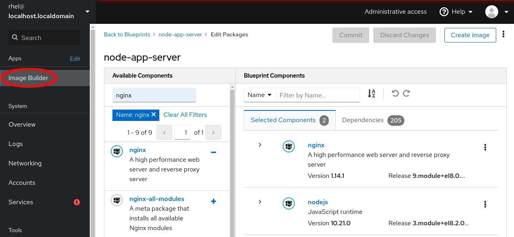
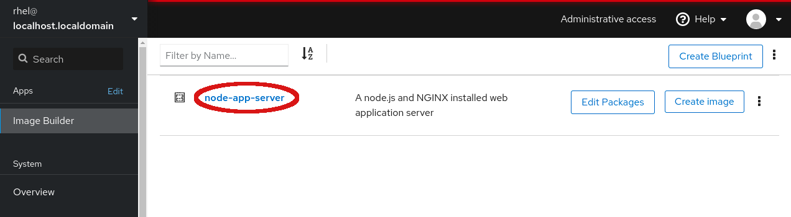
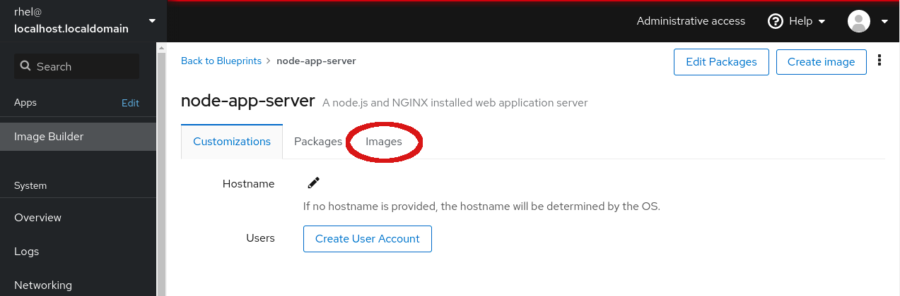
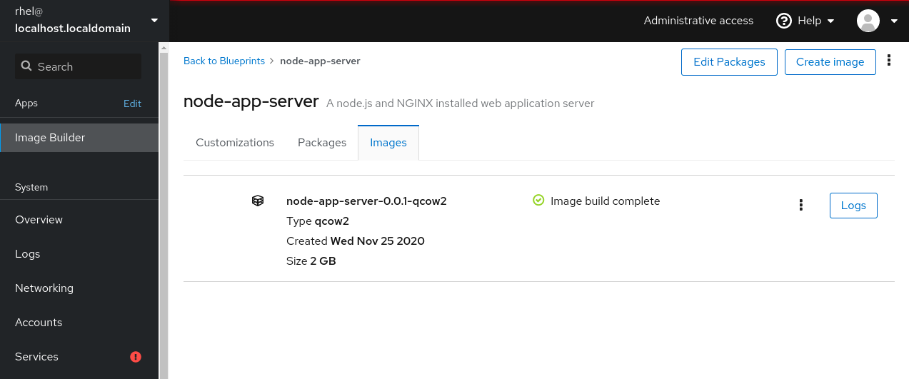

# Review and access images

In the previous step, you started a build of your __node-app-server__ machine
image.  Now it is time to check on the build process.

Return to the main Image Builder page by either selecting *Image Builder* in the
navigation menu or by using *Back to Blueprints* in the breadcrumbs.

On the main Image Builder page, you can see your blueprint, *node-app-server*,
click on this blueprint to see the details.

On the *node-app-server* page you can see several options for working with
this blueprint including:
* Edit Packages
* Create image
* Customizations
* Packages
* Images

We both *Edited Packages* and *Create image* earlier.  Now it is time to use
the *Images* tab to look at the images that are either being built or have
been built.

Depending on how long it has taken you to reach this stage, you may see that
the image you started in a previous step has already completed building (as
shown in the screenshot), is still building, or is queued to be built.

From here on the *Images* list, you can view the status of images or, if the
image has completed building, download it using the *...* button.  If the image
has failed to build, or you are just curious on what Image Builder has done,
you can view the *Logs* of the build as well.

Congratulations on making your first image!

Now that you have completed making your first image, feel free to try out making
*Customizations* or maybe *Edit Packages* to further customize the blueprint.
