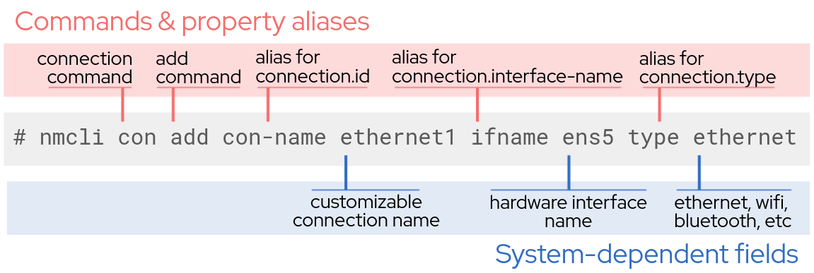

# Dynamic IP configuration with DHCP

The command `nmcli con`, short for connection, is an easy way to make persistent
configuration changes to any connection on your network. Dynamic IP configuration
with DHCP is the most common way to configure a connection,
so the first connection you make in this lab will be dynamic.
If you want more information about when to use dynamic vs.
static connections, [this article](https://www.redhat.com/sysadmin/static-dynamic-ip-1)
provides a great background.

You will configure a dynamic IP connection on **host01**. You will use the
`nmcli con` command with some additional arguments to specify that you want
to `add` a connection, assign a connection name, choose a network interface
to assign the connection to, and specify the type type of device the interface
uses. Below is an example of this command with each of the values explained:



(click to enlarge)

Run the command to configure this dynamic connection on **host01**:

```
nmcli con add con-name ethernet1 ifname ens5 type ethernet
```

You should see a confirmation message similar to

<pre class=file>
Connection 'ethernet1' (9957b40e-be3a-4291-b466-e591322aba51) successfully added.
</pre>

>_NOTE:_ NetworkManager will act as the DHCP client when adding a connection
without a specified address.

The advantage of using `nmcli` is that configuration changes persist. The
`con add` command you ran above will create a new configuration file,
`ifcfg-ethernet1`, in the `/etc/sysconfig/network-scripts` directory.

>_NOTE:_ The suffix after `ifcfg-` in the config file name will be the
connection name as you configured it when running `nmcli con add`

The configuration file for this connection contains the values corresponding
to the new connection. The `grep` command is useful for searching for specific
file contents. You will single in on the line specifying the
protocol by searching for `BOOTPROTO` in the connection config file:

```
grep 'BOOTPROTO' /etc/sysconfig/network-scripts/ifcfg-ethernet1
```

You will see that the protocol is indeed set to DHCP for this connection.
The IP address is not set at this point, as it will be controlled
through the DHCP client.

<pre class=file> BOOTPROTO=dhcp </pre>

Some situations call for an IP that will not change over time, or a static IP.
The next page will walk you through turning this dynamic connection into a
static connection.
