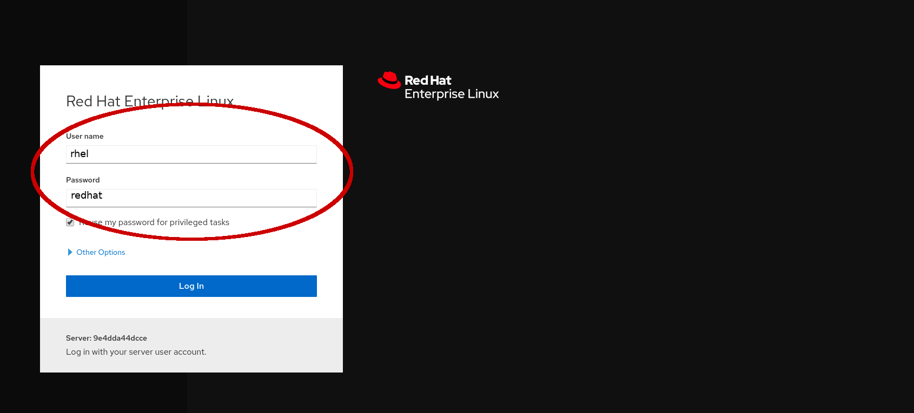
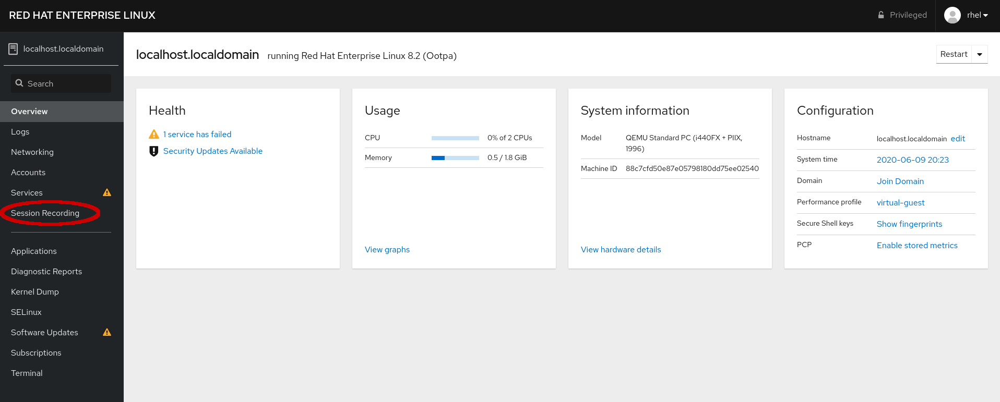

# Logging in and navigating Web Console

Now that the required software is installed, it is time to configure and
enable terminal session recording.  You will use the Web Console to perform
this task.

Use the *Web Console* tab in your lab environment to log into the Web
Console for the system.  You should use the following credentials:

Username: __rhel__
Password: __redhat__

>**NOTE:** Problems accessing the Web Console or logging in? For best results, copy and paste the URL into Google Chrome.

Now that you are logged into the Web console, and because you have installed
the __cockpit-session-recording__ rpm package, you can now select the
*Session Recording* option in the left-side navigation menu.

