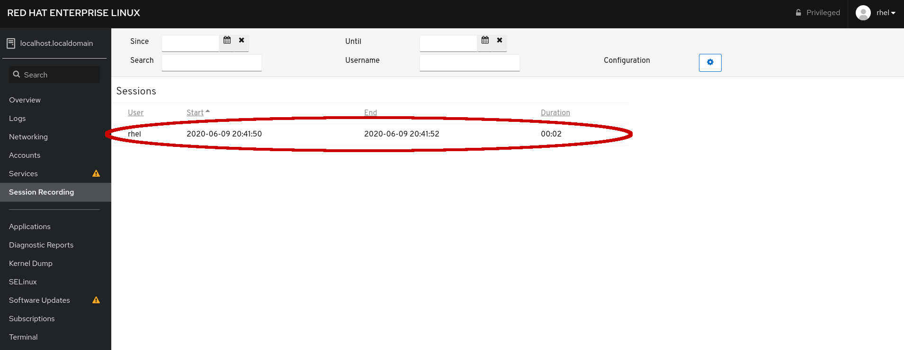
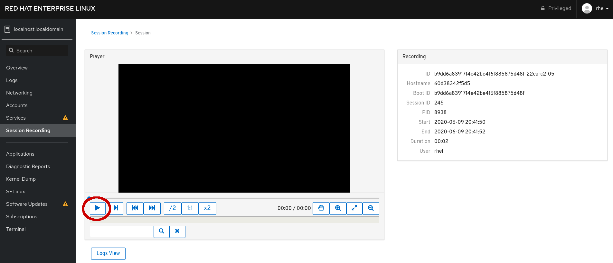

# Reviewing a recorded session in Web Console

Navigate back over to the *Web Console* tab in your lab environment.

If you are not already on the *Session Recording* page, please navigate
there.

You should now see a recorded session available.

After selecting the session, you will be taken to a page with an integrated
player through which you can watch the session.  Press the *Play* button to
review the session.

The session was recorded in real-time, so if you started the `bash` session
but did not start running commands immediately, you will see that wait time
reflected in the recorded session as well.

In addition to some standard video player functionality, the buttons on the
right side of the player will allow you to zoom in and out to get closer,
or further away, look at the content.  Also, the search function located at
the bottom of the player window will search the recorded session for text
and report time codes at which that string is found.  Those time codes are
links, which will change the location of the playback in the player.

Below the player is additional metadata about this session as well as the
log entries for the session.
