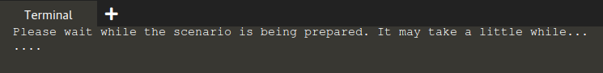

# Introducing the scenario

The goal in this scenario is to enable automatic unlocking of encrypted devices on boot, and to do that,
we will use two machines in a client/server fashion, consisting of the following machines:

| Role                 | IP Address        |
| ---------------------| ------------------|
| Server (`tang`)        | `192.168.122.1`   |
| Client (`clevis`)      | `192.168.122.100` |

The next image shows the `Terminal`, that it is visible on the right side of the screen. You will use that terminal throughout this training scenario.

Let's start!
