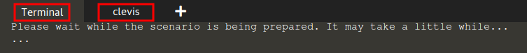

# Introducing the scenario

The goal in this scenario is to enable automatic unlocking of encrypted devices on boot, and to do that,
we will use two machines in a client/server fashion, consisting of the following machines:

| Role                 | Label on the terminal tab | IP Address        |
| ---------------------| --------------------------| ------------------|
| Server (tang)        | `Terminal`                | `192.168.122.1`   |
| Client (clevis)      | `clevis`                  | `192.168.122.100` |

The next image highlights the `Terminal` and `clevis` terminal tabs, for easier identification.

Let's start!
