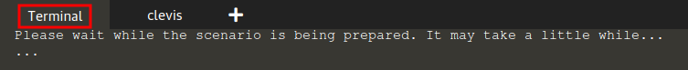

# Setting up `tang`

To start setting up `tang`, go to the `Terminal` tab.



When the scenario is ready, you should see a prompt similar to this:

```
[root@tang /]#
```

## Installing and starting `tang`

We start by installing `tang`, which can be done by issuing the following command:

`dnf install -y tang`{{execute}}

Once the previous command completes, please start and enable `tang` with the following command:

`systemctl enable --now tangd.socket`{{execute}}

## Checking whether `tang` is responding properly

At this point, `tang` should be up and running, and we can verify this by issuing the following command, which will download a `tang` advertisement:

`curl localhost/adv`{{execute}}

We should see as output a JSON that looks like this:

```json
{"payload": "eyJrZXlz...", "protected": "eyJhbGciOiJFUzUxMiIsImN0eSI6Imp3ay1zZXQranNvbiJ9", "signature": "ACWDhcrj0fQxLS4sgVW7wsFryYMZgQVppDQALKHqMaJksH_RzJFPM8cOA24CUchLKpTjBG51hby9d_CesDYkb4BlAd4NafoLVSXq_YxaCdaItoEaGEAjCXMMFZIBJMqkVCoKtIK_3VUdZD3PqU4wQnfhhk2Tx_Vt1hZYpcKocoOzft2W"}
```

This indicates that the server is responding as expected.

Note that the actual values for the `payload` and other fields in the JSON will differ from
the example output displayed above.
