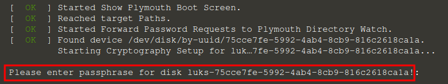
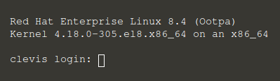

# Setting up `clevis` and identifying the encrypted devices

Please start by booting up the `clevis` machine by issuing the following command:

`boot-clevis`{{execute}}

This should boot up the clevis machine and you will be able to see its output as it boots up.

## LUKS unlocking

The `clevis` machine contains encrypted (LUKS) devices that need to be unlocked before the boot is able to continue. At some point, you will be prompted to enter the LUKS passphrase, in a similar way to what is displayed in the next image:



Once you reach this point, please enter the following LUKS passphrase to unlock the encrypted devices:

| LUKS passphrase       |
|-----------------------|
| `katacoda`{{execute}} |

After you enter the LUKS passphrase, the boot proceeds as usual.

## Logging in

Once the machine completely boots up, you will see the login prompt:



Please perform the login with the following credentials:

| User              | Password            |
|-------------------|---------------------|
| `root`{{execute}} | `rhel`{{execute}} |


## Installing clevis

Note that for this particular scenario, `clevis` and other required packages like `clevis-dracut`
are already installed for you, so **you do not need to issue the following command**.

For reference, this is how you would install it:

`dnf install -y clevis clevis-dracut`

The previous command will install some `clevis` subpackages, and once that step is completed, we can move on to identifying the encrypted devices in this machine. Again, it is not required for this scenario, since `clevis` is already installed.

## Identifying the encrypted devices

We can use `lsblk` to identify the devices that are encrypted, in the following way:

`lsblk --fs`{{execute}}

We will see an output similar to this:

```
NAME              FSTYPE LABEL UUID                                   MOUNTPOINT
vda
├─vda1            xfs          bd5edf31-983b-449d-9330-cac3d2b4873b   /boot
└─vda2            crypto       75cce7fe-5992-4ab4-8cb9-816c2618ca1a
  └─luks-75cce7fe-5992-4ab4-8cb9-816c2618ca1a
                  LVM2_m       RLOSzN-S7Qd-GfU1-GF0y-agZx-ISWn-DSmX5G
    ├─rhel_clevis-root
    │             xfs          2e1f2fde-aec4-4024-80e3-139ba3f7b062   /
    └─rhel_clevis-swap
                  swap         f2d3af83-2fcf-45cb-ae61-0c8a5144eba4   [SWAP]
```

Paying attention to the last output, we can see that `/dev/vda2` has `crypto` as its `FSTYPE` (filesystem type), meaning that it is an encrypted (LUKS) device. The image shown next highlights this. Let's take note of the name of the encrypted device  -- `/dev/vda2` -- for the next step.


