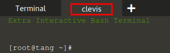

# Setting up `clevis` and identifying the encrypted devices

To proceed with the `clevis` portion of the scenario, please open the terminal tab labeled `clevis`.



You should see a prompt similar to this, which indicates it's ready to start the `clevis` scenario:
```
[root@tang /]#
```

At this point, please boot up the `clevis` machine by issuing the following command:

`clevis-scenario`{{execute}}

This should boot up the clevis machine and you will be able to see its output as it boots up.

## LUKS unlocking

The `clevis` machine contains encrypted (LUKS) devices that need to be unlocked before the boot is able to continue. At some point, you will be prompted to enter the LUKS passphrase, in a similar way to what is displayed in the next image:


Once you reach this point, please enter the following LUKS passphrase to unlock the encrypted devices:

| LUKS passphrase       |
|-----------------------|
| `katacoda`{{execute}} |

After you enter the LUKS passphrase, the boot proceeds as usual.

## Logging in

Once the machine completely boots up, you will see the login prompt:


Please perform the login with the following credentials:

| User              | Password            |
|-------------------|---------------------|
| `root`{{execute}} | `fedora`{{execute}} |


## Installing clevis

We can now install `clevis`, by issuing the following command:

`dnf install -y clevis clevis-dracut`{{execute}}

The previous command will install some `clevis` subpackages, and once that step is completed, we can move on to identifying the encrypted devices in this machine.

## Identifying the encrypted devices

We can use `lsblk` to identify the devices that are encrypted, in the following way:

`lsblk --fs`{{execute}}

We will see an output similar to this:

```
NAME FSTYPE FSVER LABEL UUID                                 FSAVAIL FSUSE% MOUNTPOINT
zram0
                                                                            [SWAP]
vda
├─vda1
│    ext4   1.0         5072c4f3-1262-44da-9cff-fe9473c08c69  805.1M    11% /boot
└─vda2
     crypto 2           acf05c84-1288-47ab-9897-48e6710890b9
  └─luks-acf05c84-1288-47ab-9897-48e6710890b9
     btrfs        fedora_clevis
                        406ebe4f-dd7f-40fe-8861-731de2a9125d    2.7G    20% /
```

Paying attention to the last output, we can see that `/dev/vda2` has `crypto` as its `FSTYPE` (filesystem type), meaning that it is an encrypted (LUKS) device. The image shown next highlights this. Let's take note of the name of the encrypted device  -- `/dev/vda2` -- for the next step.


