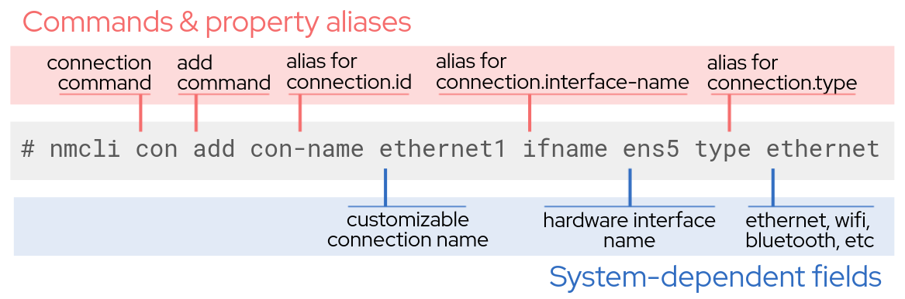

# Dynamic IP configuration with DHCP

Dynamic IP configuration with DHCP is the most common way to configure a connection.
If you want more information about when to use dynamic vs.
static connections, [this article](https://www.redhat.com/sysadmin/static-dynamic-ip-1) provides great background.

Let’s configure a dynamic connection on `host02`. This can be done with
the following command:

`nmcli con add con-name ethernet1 ifname ens5 type ethernet`{{execute "host01"}}

**Note:** NetworkManager will act as the DHCP client when adding a connection
without a specified address.

Let’s take a look at the configuration file for our connection to see
what this command has done. We will single in on the line specifying the
protocol and the configured IP by searching for the `BOOTPROTO` and
`IPADDR` lines:

`cat /etc/sysconfig/network-scripts/ifcfg-ethernet1 | grep 'BOOTPROTO\|IPADDR'`{{execute "host01"}}

You will see that the protocol is indeed set to DHCP for this connection.
Furthermore, the IP address is not set at this point, as it will be controlled
through the DHCP client.

<pre class=file> BOOTPROTO=dhcp </pre>

The search did not find the field `IPADDR` in this config because we are not
manually setting an IP when we configure a dynamic connection.

Some situations call for an IP that can't change over time, or a static IP.
The next page will walk you through turning this dynamic connection into a
static connection.
