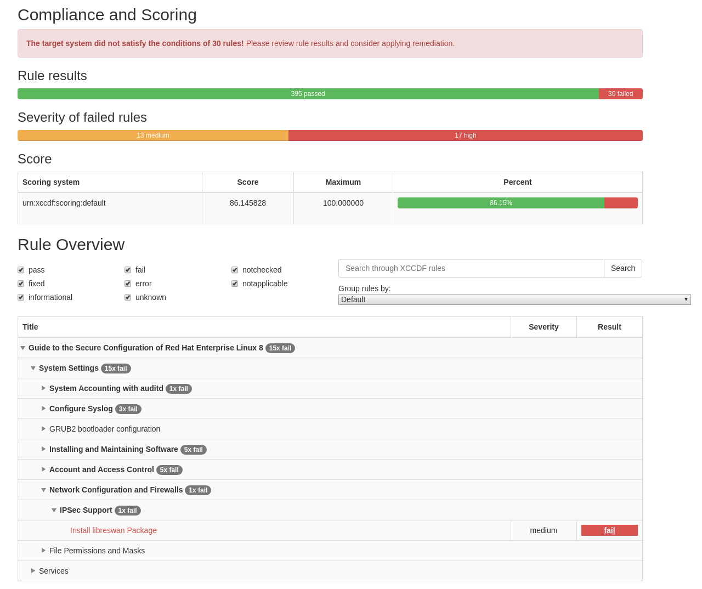

# Running a scan against a profile

A XCCDF document is a structured collection of security configuration rules for some set of target system. In this case, it has the 
configuration rules that meet the PCI regulation.

Run the *oscap* tool providing the XCCDF formatted profile with ID, option to fetch remote resources, report output file name, and 
checklist file as per the SCAP security guide.

`oscap xccdf eval --fetch-remote-resources --profile xccdf_org.ssgproject.content_profile_pci-dss --results /tmp/scan-xccdf-results.xml --report /var/www/html/index.html /usr/share/xml/scap/ssg/content/ssg-rhel8-ds.xml`{{execute T1}}

__Note:__ This scan can take a few minutes to complete as it has to evaluate all the rules and store the results in the /tmp directory and generate the html report.  

<pre class="file">
Downloading: https://www.redhat.com/security/data/oval/com.redhat.rhsa-RHEL8.xml ... ok
Title   Enable auditd Service
Rule    xccdf_org.ssgproject.content_rule_service_auditd_enabled
Ident   CCE-80872-5
Result  pass

Title   Enable Auditing for Processes Which Start Prior to the Audit Daemon
Rule    xccdf_org.ssgproject.content_rule_grub2_audit_argument
Ident   CCE-80825-3
Result  pass

Title   Configure auditd mail_acct Action on Low Disk Space
Rule    xccdf_org.ssgproject.content_rule_auditd_data_retention_action_mail_acct
Ident   CCE-80678-6
Result  pass

Title   Configure auditd admin_space_left Action on Low Disk Space
Rule    xccdf_org.ssgproject.content_rule_auditd_data_retention_admin_space_left_action
Ident   CCE-80679-4
Result  pass

Title   Configure auditd Number of Logs Retained
Rule    xccdf_org.ssgproject.content_rule_auditd_data_retention_num_logs
Ident   CCE-80683-6
Result  pass

Title   Configure auditd max_log_file_action Upon Reaching Maximum Log Size
Rule    xccdf_org.ssgproject.content_rule_auditd_data_retention_max_log_file_action
Ident   CCE-80682-8
Result  pass

Title   Configure auditd space_left Action on Low Disk Space
Rule    xccdf_org.ssgproject.content_rule_auditd_data_retention_space_left_action
Ident   CCE-80684-4
Result  pass

Title   Configure auditd Max Log File Size
Rule    xccdf_org.ssgproject.content_rule_auditd_data_retention_max_log_file
Ident   CCE-80681-0
Result  pass

<< OUTPUT ABRIDGED >>
</pre>

Once the command completes, you can look at the pass/fail status of each rule in the output, or check the *OpenSCAP Report* tab of this lab interface 
to view the scan report in HTML format.

From the report, you will notice that there are about 30 or so rules that have failed, and the next steps will focus on remediating one of them 
related to IPSec.
